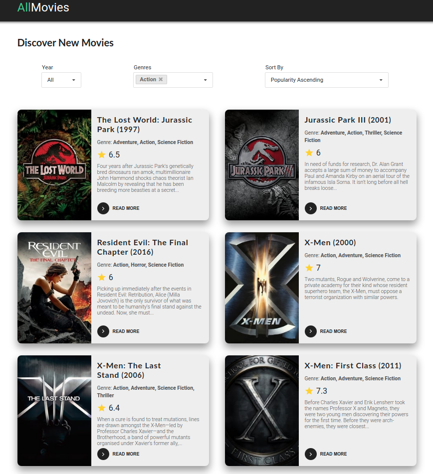
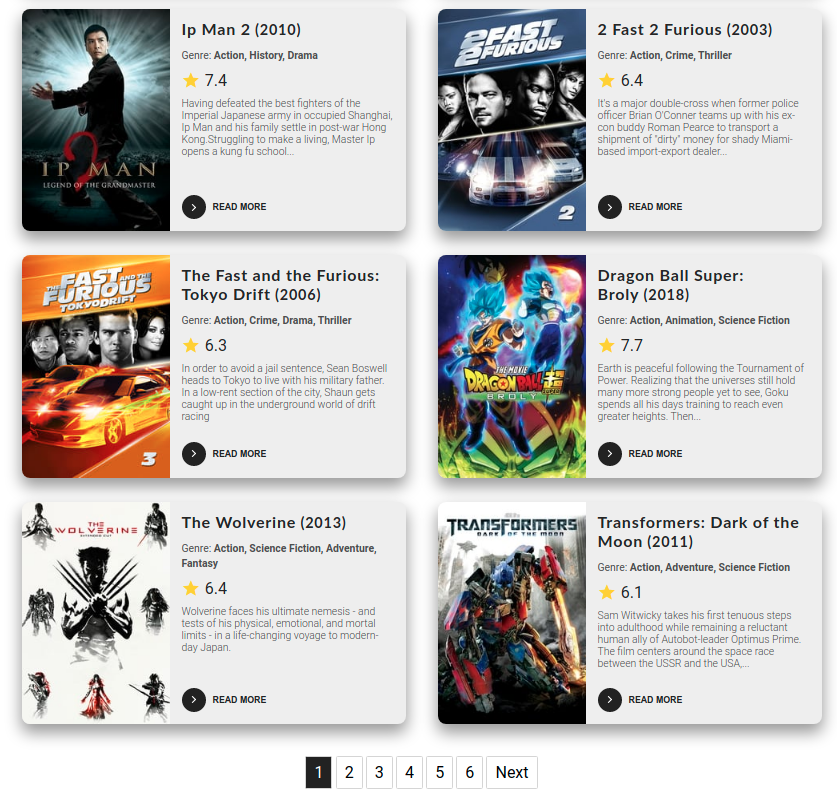

# AllMovies
## Table of contents

- [General info](#general-info)
- [Technologies](#tenchnologies)
- [Setup](#setup)
- [Screenshot](#screenshot)

## General info

Project for browsing and filtering movies. Used themoviedb.org database/api. Project created for educational purposes.

## App Demo

(https://all-movies.herokuapp.com/)

## Technologies

Project is created with:

- React
- HTML5
- CSS3

## Setup

To run this project, install it locally using npm or yarn:

```
$ npm install / yarn
$ npm run start / yarn start
```

## Screenshots



